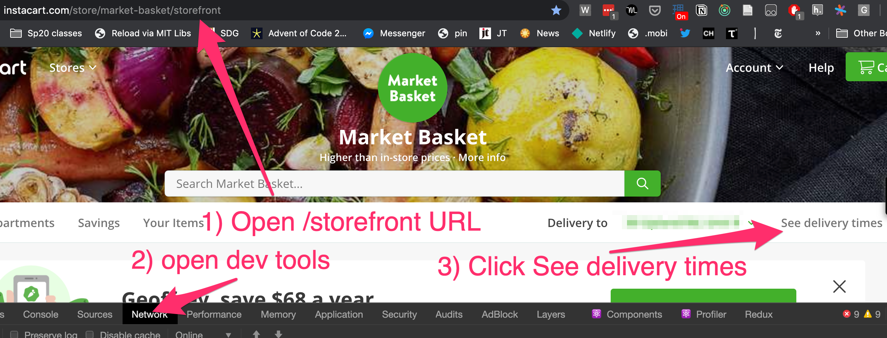
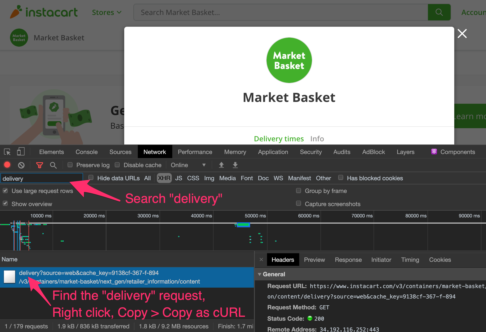
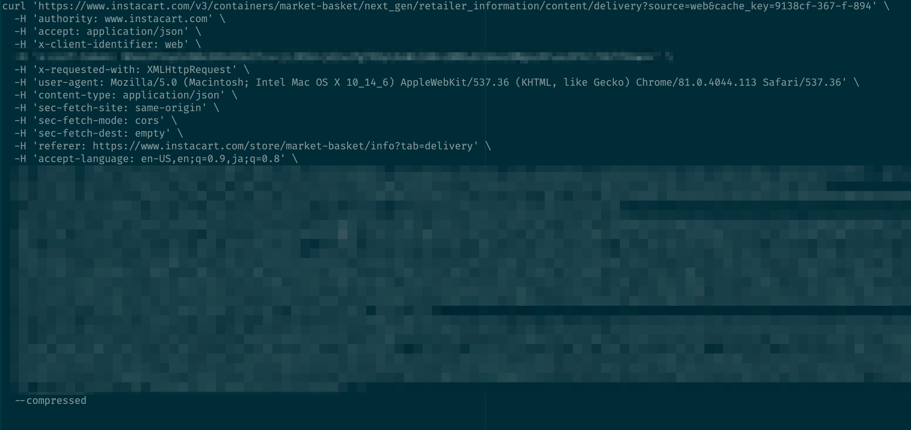

# Instacart checker

A ruby script that polls Instacart's API once a minute to look for delivery slots.
Run it on your computer, it'll ping a notification when it finds one.

You should have an Instacart cart ready in advance.
When you get the notification you can quickly open Instacart's site to checkout.
Don't worry about finalizing your cart; you can always edit it later
after you checkout.

This code was hastily thrown together so YMMV, but worst case it just
won't find a slot -- it can't really mess anything up.
It successfully found a slot for me within a few hours of running.

Tested on Mac OS with ruby 2.6.

## To set it up

### Install the code

Make sure you have ruby installed: `ruby -v`

Clone this repo: `git clone https://github.com/geoffreylitt/instacart-checker`

Install terminal-notifier to get a desktop notification when it finds a slot: `brew install terminal-notifier`

### Copy your unique instacart request

This script uses your currently logged in Instacart session to authenticate
to Instacart's web endpoint. To set it up you need to get some data
out of your browser.

Open the Instacart store page for the store you want.
Open the browser dev tools to the network tab, then
click "see delivery times":

In the network tab, search "delivery" and you should see one network request.
This is the request that's getting delivery slot info from Instacart.

Right click the request, and hit copy > copy as cURL. (_not copy ALL as cURL_)

Paste the result into `curl.txt` in this repo.
It should look vaguely like this:

## Run it!

Run the script in test mode to ensure the notification feature works:
`ruby instacart.rb --test`

Run it in normal mode, which will poll once a minute and check for a spot.
`ruby instacart.rb`
